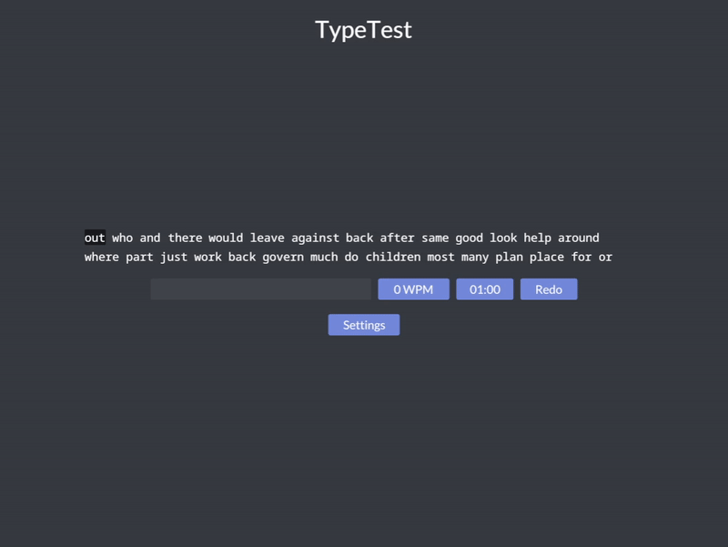

# TypeTest

An offline typing test, written using Rust and Iced. Inspired by [typetest.io](https://typetest.io/) and [10fastfingers.com](https://10fastfingers.com/).



## Usage

Install from crates.io:

```
cargo install typetest
```

Or alternatively, clone this repository and run from the source code:

```
git clone https://github.com/Ace4896/typetest.git
cd typetest
cargo run --release
```

**NOTE**: Linux users may want to look [here](https://github.com/hecrj/iced/issues/256) if there are linking errors due to missing dependencies.
